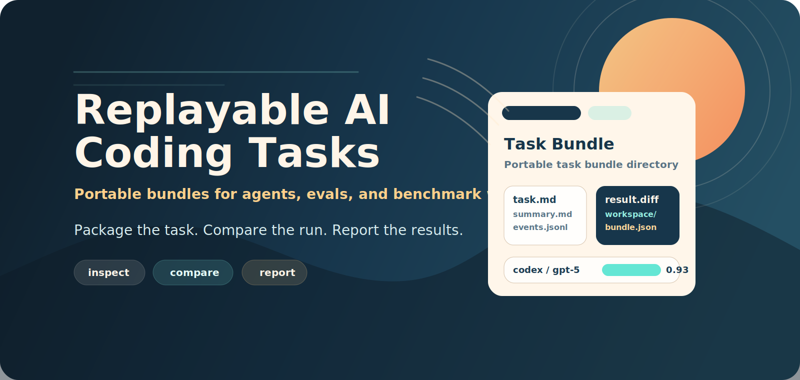
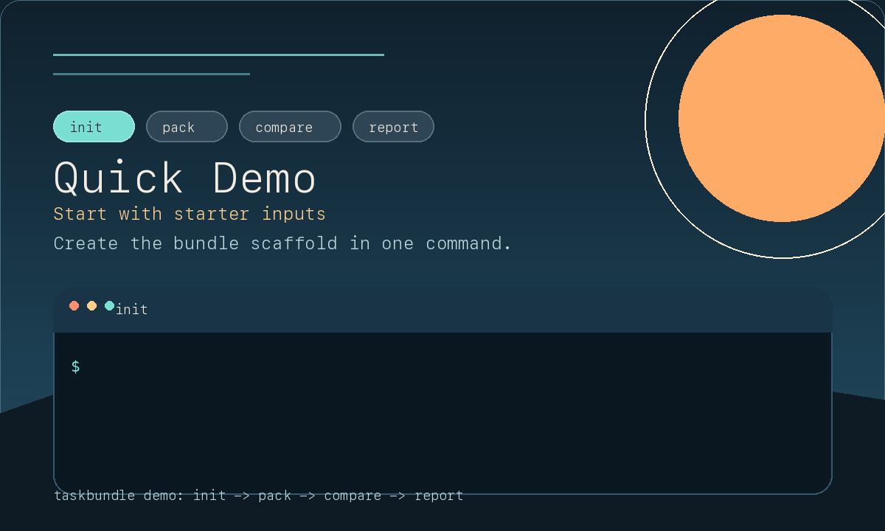
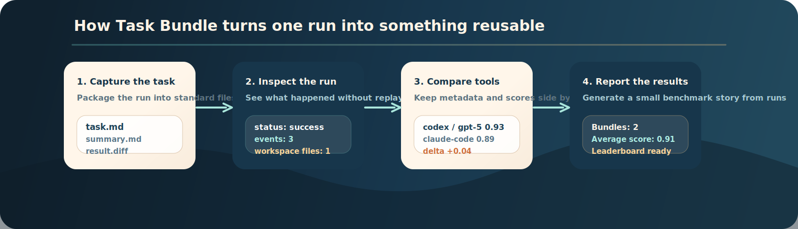
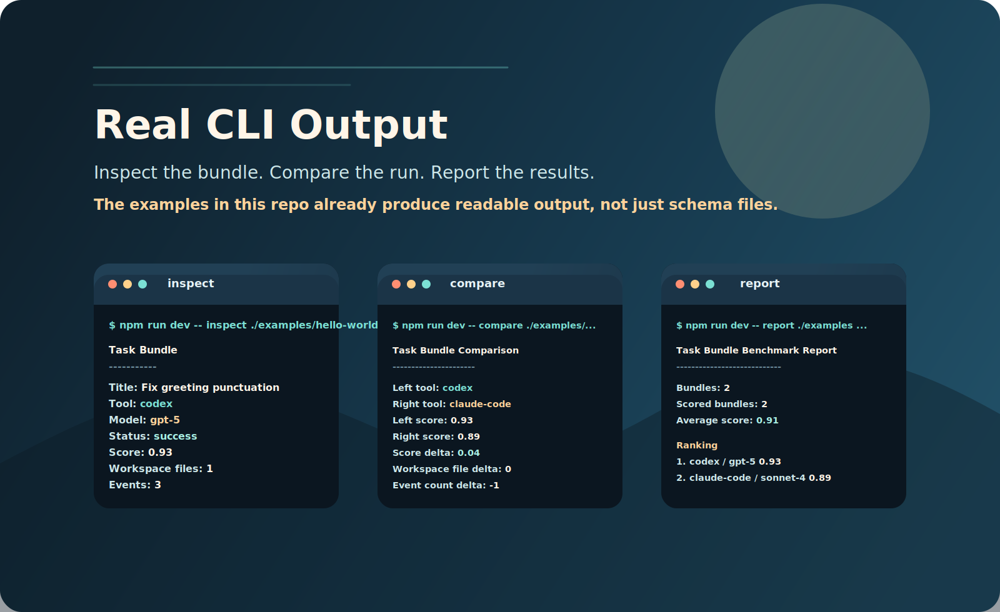

# Task Bundle

[English](./README.md) | [简体中文](./README.zh-CN.md)

<p align="center">
  
</p>

<p align="center"><strong>把 AI coding 过程整理成可分享、可比较、可重跑的任务包。</strong></p>
<p align="center">适合用在聊天记录太散、完整 benchmark 平台又太重的时候。</p>
<p align="center">
  <a href="#quickstart"><strong>快速开始</strong></a> ·
  <a href="#example-output"><strong>示例输出</strong></a> ·
  <a href="#where-it-fits"><strong>方案对比</strong></a> ·
  <a href="./docs/bundle-format.zh-CN.md"><strong>格式说明</strong></a> ·
  <a href="./docs/sample-benchmark-report.zh-CN.md"><strong>示例报告</strong></a> ·
  <a href="./ROADMAP.zh-CN.md"><strong>路线图</strong></a>
</p>

[](https://github.com/wimi321/task-bundle/actions/workflows/ci.yml)
[](https://github.com/wimi321/task-bundle/stargazers)
[](./LICENSE)

Task Bundle 是一个 TypeScript + Node.js CLI，用来把一次编码任务打包成可以查看、比较、归档、校验、生成报告的目录。

你可以用它来：
- 把任务输入、执行摘要、diff、事件和工作区文件放在一起
- 比较 Codex、Claude Code、Cursor 或内部工具的运行结果，并保留元数据、哈希和 outcome 字段
- 从一组 bundle 生成 benchmark 风格报告
- 为后续重跑保留足够上下文，而不是追求逐 token 一致性

它比较适合这些场景：
- 查看一次任务最后到底做了什么
- 把任务结果分享给别人
- 在之后重新执行同一个任务
- 比较不同模型或工具在同一起点上的表现
- 作为未来 replay / benchmark 工作流的基础层

它不打算解决这些问题：
- agent 框架
- 聊天 UI
- provider 路由器
- benchmark 平台
- token 级录制器

<a id="quickstart"></a>

## 快速开始

用仓库自带示例，1 分钟就能跑出一个真实对比：

```bash
npm install
npm run build
npm run dev -- compare ./examples/hello-world-bundle ./examples/hello-world-bundle-claude
```

这是最快看懂项目在做什么的一组命令。





<a id="example-output"></a>

## 示例输出



先查看一个 bundle：

```text
$ npm run dev -- inspect ./examples/hello-world-bundle
Task Bundle
-----------
Title: Fix greeting punctuation
Tool: codex
Model: gpt-5
Status: success
Score: 0.93
Workspace files: 1
Events: 3
```

再比较两个工具在同一个任务上的结果：

```text
$ npm run dev -- compare ./examples/hello-world-bundle ./examples/hello-world-bundle-claude
Task Bundle Comparison
----------------------
Left tool: codex
Right tool: claude-code
Left score: 0.93
Right score: 0.89
Score delta: 0.04
Workspace file delta: 0
Event count delta: -1
```

最后从一组 bundle 直接生成 benchmark 风格摘要：

```text
$ npm run dev -- report ./examples --out ./dist/benchmark-report.md
Bundles: 2
Average score: 0.91

Ranking
1. Fix greeting punctuation | codex / gpt-5 | success | score 0.93
2. Fix greeting punctuation | claude-code / claude-sonnet-4 | success | score 0.89
```

也可以直接查看仓库里提交好的示例报告：
- [docs/sample-benchmark-report.zh-CN.md](./docs/sample-benchmark-report.zh-CN.md)
- [docs/sample-benchmark-report.md](./docs/sample-benchmark-report.md)

<a id="where-it-fits"></a>

## 和常见方案对比

| 需求 | 聊天记录 | Zip / tarball | 完整 benchmark 平台 | Task Bundle |
| --- | --- | --- | --- | --- |
| 把原始任务和最终结果放在一起分享 | 部分满足 | 可以 | 可以 | 可以 |
| 在同一起点上比较不同工具 | 较弱 | 很靠手工 | 可以 | 可以 |
| 携带 artifact 哈希和结果元数据 | 不行 | 不行 | 可以 | 可以 |
| 足够轻，能融入日常 coding 工作流 | 可以 | 可以 | 不太行 | 可以 |
| 之后继续扩展成 replay / benchmark 工作流 | 较弱 | 较弱 | 可以 | 可以 |

## 为什么值得关注

很多 AI coding 结果最后只留下截图、聊天记录或者一个 patch，后续几乎没法稳定比较。

Task Bundle 想解决的就是这个问题：把一次任务变成一个可以查看、归档、比较、校验、生成报告的稳定单元。它比较适合：
- 想做可复现实验的 agent 作者
- 想做任务评测和 benchmark 的团队
- 想比较 Codex、Claude Code、Cursor 或内部工具的开发者
- 更关心可重跑，而不是逐 token 一致性的人

## 这里的 Replay 是什么意思

Task Bundle 里的 replay 指的是“可重新执行、可比较”，不是“逐帧复刻”。

它不追求把每一步 prompt 和每一个 token 原样重演，而是希望把任务描述、起始文件、元数据和最终结果整理成一个稳定格式，让别的工具或后续版本可以在相近条件下再次执行，并进行比较。

## Bundle 目录结构

```txt
task-bundle/
  bundle.json
  task.md
  summary.md
  events.jsonl
  result.diff
  workspace/
    manifest.json
    files/...
```

相关文档：
- [docs/bundle-format.zh-CN.md](./docs/bundle-format.zh-CN.md)
- [docs/bundle-format.md](./docs/bundle-format.md)
- [docs/design-decisions.md](./docs/design-decisions.md)
- [docs/replay-contract.md](./docs/replay-contract.md)

## 五分钟演示

1. 安装依赖并构建：

```bash
npm install
npm run build
```

2. 查看仓库自带示例：

```bash
npm run dev -- inspect ./examples/hello-world-bundle
```

3. 比较两个由不同工具生成的示例 bundle：

```bash
npm run dev -- compare ./examples/hello-world-bundle ./examples/hello-world-bundle-claude
```

4. 校验示例 bundle 是否满足 replay-ready：

```bash
npm run dev -- validate ./examples/hello-world-bundle
```

5. 扫描整个 examples 目录：

```bash
npm run dev -- scan ./examples
```

6. 生成 benchmark 风格报告：

```bash
npm run dev -- report ./examples --out ./dist/benchmark-report.md
```

7. 生成 starter 输入目录：

```bash
npm run dev -- init --out ./starter
```

8. 直接从配置文件打包：

```bash
npm run dev -- pack --config ./starter/taskbundle.config.json
```

9. 把 bundle 归档成 `.tar.gz`：

```bash
npm run dev -- archive ./starter/bundle-output --out ./starter/bundle-output.tar.gz
```

## 命令说明

### `taskbundle init`
生成 starter 文件：

```bash
npm run dev -- init --out ./starter
```

会写出：
- `task.md`
- `summary.md`
- `events.jsonl`
- `result.diff`
- `workspace-files/`
- `taskbundle.config.json`
- `README.md`

### `taskbundle pack`
把任务输入整理成标准 bundle 目录。

显式参数方式：

```bash
npm run dev -- pack \
  --title "Fix auth bug" \
  --task ./starter/task.md \
  --summary ./starter/summary.md \
  --diff ./starter/result.diff \
  --events ./starter/events.jsonl \
  --workspace ./starter/workspace-files \
  --tool "codex" \
  --model "gpt-5" \
  --runtime "node" \
  --repo "owner/repo" \
  --commit "abc123" \
  --tag demo \
  --out ./dist/fix-auth-bundle
```

配置文件方式：

```bash
npm run dev -- pack --config ./starter/taskbundle.config.json
```

`pack` 现在还支持：
- 自动采集 git 元数据
- 在 `bundle.json` 中记录 artifact 哈希和大小
- 写入 benchmark / judge 结果字段，例如 `status`、`score`、`judgeNotes`
- 用 `--archive` 直接生成 `.tar.gz`

### `taskbundle inspect`
读取 bundle 并打印摘要：

```bash
npm run dev -- inspect ./examples/hello-world-bundle
```

也支持 JSON 输出：

```bash
npm run dev -- inspect --json ./examples/hello-world-bundle
```

### `taskbundle compare`
比较两个 bundle：

```bash
npm run dev -- compare ./examples/hello-world-bundle ./examples/hello-world-bundle-claude
```

JSON 输出：

```bash
npm run dev -- compare --json ./examples/hello-world-bundle ./examples/hello-world-bundle-claude
```

### `taskbundle archive`
把 bundle 目录归档成 `.tar.gz`：

```bash
npm run dev -- archive ./examples/hello-world-bundle --out ./dist/hello-world-bundle.tar.gz
```

### `taskbundle extract`
解压 bundle 归档：

```bash
npm run dev -- extract ./dist/hello-world-bundle.tar.gz --out ./dist/extracted
```

### `taskbundle validate`
校验 bundle 并检查它是否具备 replay-ready 条件：

```bash
npm run dev -- validate ./examples/hello-world-bundle
```

### `taskbundle scan`
扫描某个目录下的 bundle：

```bash
npm run dev -- scan ./examples
```

### `taskbundle report`
生成 benchmark 风格的排行榜和可选 Markdown 报告：

```bash
npm run dev -- report ./examples --out ./dist/benchmark-report.md
```

## 示例 Bundle

仓库里现在有两个示例：
- [examples/hello-world-bundle](./examples/hello-world-bundle)
- [examples/hello-world-bundle-claude](./examples/hello-world-bundle-claude)

它们表达的是同一个任务，但来自不同的工具 / 模型组合，所以 `compare` 命令有真实可看的结果。

你也可以直接把这个目录交给 `taskbundle report`，生成一份小型 benchmark 排行榜。

如果你想直接看一份已提交到仓库里的报告快照，可以打开 [docs/sample-benchmark-report.zh-CN.md](./docs/sample-benchmark-report.zh-CN.md)。

## Bundle 格式一眼看懂

- `bundle.json`：顶层元数据和 artifact 指针
- `artifactInfo`：可选的 artifact 大小与哈希信息
- `task.md`：原始任务、约束和验收标准
- `summary.md`：简短的人类可读结果摘要
- `result.diff`：最终 patch / diff
- `events.jsonl`：关键动作和转折点，不记录每个 token
- `workspace/manifest.json`：文件路径、大小、哈希清单
- `workspace/files/`：捕获到的任务相关文件
- `git`：可选的 git root / branch / remote / commit 信息
- `runner`：可选的打包运行时信息
- `outcome`：可选的 benchmark / judge 结果字段

## 本地开发

### 安装

```bash
npm install
```

### 构建

```bash
npm run build
```

### 测试

```bash
npm test
```

### 全量检查

```bash
npm run check
```

### 运行 CLI

```bash
node dist/cli/index.js inspect ./examples/hello-world-bundle
```

或者直接用开发入口：

```bash
npm run dev -- inspect ./examples/hello-world-bundle
```

## 项目结构

```txt
src/
  cli/
    commands/
  core/
  utils/
examples/
  hello-world-bundle/
  hello-world-bundle-claude/
docs/
  bundle-format.md
  bundle-format.zh-CN.md
  design-decisions.md
  replay-contract.md
```

## 当前限制

- 归档格式目前是 `.tar.gz`，不是 `.zip`
- compare 现在可以比较 metadata、score 和 artifact hash，但它仍然不会自动做语义级代码评判
- workspace 捕获仍然基于显式文件集合，而不是整仓库镜像策略
- 还没有 viewer UI

## 路线图

见：
- [ROADMAP.zh-CN.md](./ROADMAP.zh-CN.md)
- [ROADMAP.md](./ROADMAP.md)
